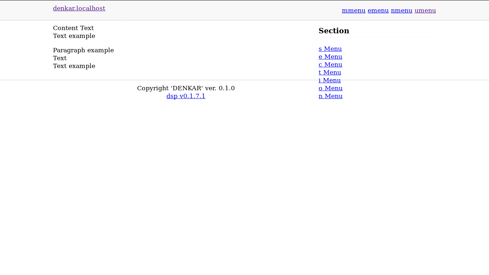
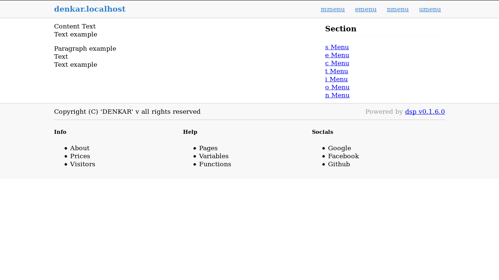

dsyte v0.1.7.2
====================================
Templates html

# Features

* Are two themes
* In active development
* Support components: counter, section and logo

# Examples results

* Theme "light"

* Theme "pro"

# Info

Copyright (C) 2019 Denis Karabadjak

* Homepage: [https://github.com/Denpus/dsyte/#README.md]
* Keywords: [
    "html",
    "footer",
    "templates"
  ]
* Author: DenKar (Denis Karabadjak) <denkar@mail.ru>
* License: CPL-3.0
